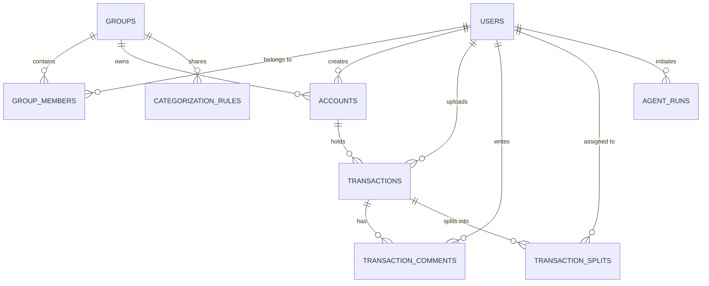

# Feature Specification: Multi-User Access & Collaborative Ledger

This specification details the transition of the Spend Analyzer from a single-user local instance to a multi-tenant, collaborative personal finance application designed for households, couples, and roommates.

---

## 📋 Target User Stories

1. **Individual vs. Joint Ledgers**:
   * *As a user*, I want to keep my personal bank accounts private while maintaining joint credit cards and savings accounts shared with my partner, so that my personal spending remains private and household spending is visible to both of us.
2. **Interactive Transaction Context**:
   * *As a household member*, I want to ask my partner about a specific unrecognized transaction by commenting directly on the transaction inside the app, rather than messaging them on a separate chat app.
3. **Bill Splitting**:
   * *As a roommate or couple*, I want to split joint expenses (like rent or grocery receipts) using customized ratios (e.g., 50/50 or 60/40), so we can track exact outstanding balances and true net worth.
4. **Shared Rule Engine**:
   * *As a family*, we want categorization rules created by one user (e.g., tagging a specific vendor as "Groceries") to apply automatically to similar transactions across all shared statements.
5. **Agent Run Context**:
   * *As a user*, I want to know who uploaded a bank statement and see the status of the parsing agent run specific to my account uploads.

---

## 🗄️ Proposed Schema Modifications (ERD Changes)

To support this multi-user structure, we transition from the current schema to a tenant-centric structure. Below are the new tables and database relationship changes.



### 1. `users` (New)
Represents individual registered users.
```sql
CREATE TABLE users (
    id VARCHAR(36) PRIMARY KEY,
    email VARCHAR(255) UNIQUE NOT NULL,
    password_hash VARCHAR(255) NOT NULL,
    first_name VARCHAR(100),
    last_name VARCHAR(100),
    created_at TIMESTAMP DEFAULT CURRENT_TIMESTAMP
);
```

### 2. `groups` (New)
Represents a tenancy unit (a family, a couple, roommates, or an individual workspace).
```sql
CREATE TABLE groups (
    id VARCHAR(36) PRIMARY KEY,
    name VARCHAR(100) NOT NULL, -- e.g. "Smith Household" or "Bhavesh Personal"
    created_at TIMESTAMP DEFAULT CURRENT_TIMESTAMP
);
```

### 3. `group_members` (New)
 Junc table linking users to groups, defining permission roles.
```sql
CREATE TABLE group_members (
    group_id VARCHAR(36) FOREIGN KEY REFERENCES groups(id),
    user_id VARCHAR(36) FOREIGN KEY REFERENCES users(id),
    role VARCHAR(20) NOT NULL, -- 'owner', 'editor', 'viewer'
    PRIMARY KEY (group_id, user_id)
);
```

### 4. `accounts` (New)
Formalizes bank/credit card account ownership.
```sql
CREATE TABLE accounts (
    id VARCHAR(36) PRIMARY KEY,
    name VARCHAR(100) NOT NULL, -- e.g. "HDFC Salary Account"
    account_type VARCHAR(30) NOT NULL, -- 'checking', 'savings', 'credit_card'
    group_id VARCHAR(36) FOREIGN KEY REFERENCES groups(id) ON DELETE CASCADE,
    created_by_user_id VARCHAR(36) FOREIGN KEY REFERENCES users(id),
    is_private BOOLEAN DEFAULT FALSE, -- If TRUE, only visible to the creator even if in group
    created_at TIMESTAMP DEFAULT CURRENT_TIMESTAMP
);
```

### 5. Updates to `transactions`
Add relations to users and accounts.
```sql
ALTER TABLE transactions ADD COLUMN account_ref_id VARCHAR(36) REFERENCES accounts(id) ON DELETE CASCADE;
ALTER TABLE transactions ADD COLUMN uploaded_by_user_id VARCHAR(36) REFERENCES users(id);
```

### 6. `transaction_comments` (New)
In-app discussion per transaction.
```sql
CREATE TABLE transaction_comments (
    id VARCHAR(36) PRIMARY KEY,
    transaction_id VARCHAR(36) FOREIGN KEY REFERENCES transactions(id) ON DELETE CASCADE,
    user_id VARCHAR(36) FOREIGN KEY REFERENCES users(id),
    comment_text TEXT NOT NULL,
    created_at TIMESTAMP DEFAULT CURRENT_TIMESTAMP
);
```

### 7. `transaction_splits` (New)
Facilitates dividing transaction amounts between group members.
```sql
CREATE TABLE transaction_splits (
    id VARCHAR(36) PRIMARY KEY,
    transaction_id VARCHAR(36) FOREIGN KEY REFERENCES transactions(id) ON DELETE CASCADE,
    assigned_user_id VARCHAR(36) FOREIGN KEY REFERENCES users(id),
    split_percentage NUMERIC(5,2) NOT NULL, -- e.g., 50.00
    split_amount NUMERIC(12,2) NOT NULL,
    is_settled BOOLEAN DEFAULT FALSE,
    created_at TIMESTAMP DEFAULT CURRENT_TIMESTAMP
);
```

### 8. Updates to `categorization_rules`
Make rules tenant-scoped.
```sql
ALTER TABLE categorization_rules ADD COLUMN group_id VARCHAR(36) REFERENCES groups(id) ON DELETE CASCADE;
ALTER TABLE categorization_rules ADD COLUMN created_by VARCHAR(36) REFERENCES users(id);
```

### 9. Updates to `agent_runs`
Track which user/group ran the ingestion orchestrator.
```sql
ALTER TABLE agent_runs ADD COLUMN user_id VARCHAR(36) REFERENCES users(id);
ALTER TABLE agent_runs ADD COLUMN group_id VARCHAR(36) REFERENCES groups(id);
```

---

## ⚡ Technical Edge Cases & Product Logic

1. **Transaction Leakage in Joint Queries**:
   * *Problem*: When calculating monthly net balance trends, a user's private account transactions must not leak into another user's view, even if both belong to the same group.
   * *Rule*: The database queries must enforce:
     `WHERE account.group_id IN (user_groups) AND (account.is_private = FALSE OR account.created_by_user_id = current_user_id)`.
2. **Asynchronous Folder Scan Ownership**:
   * *Problem*: When a file lands in `backend/statements_to_process/` or `backend/email_inbox/` autonomously, who owns it?
   * *Rule*:
     * For email scanning: The sender's email address is looked up in the `users` table. If matched, the transaction ledger and account are assigned to that user's group. If unmatched, it is quarantined.
     * For folder scanning: A metadata sidecar file (e.g. `statement_name.pdf.json`) containing `{ "user_id": "...", "account_id": "..." }` should accompany the statement, or the orchestrator falls back to a default "Admin / System" tenant.
3. **Conflicting Categorization Rules**:
   * *Problem*: User A overrides a transaction "Amazon" to "Electronics" (Shared Rule), while User B overrides another "Amazon" to "Groceries" (Shared Rule).
   * *Rule*: Rules are matched sequentially by creation date (newest first) or by user specificity (rules created by the active user take precedence over rules created by other group members for the same pattern).
4. **Self-Transfer Linking Across Private-Joint Boundaries**:
   * *Problem*: User A transfers $1000 from their private account to a joint account.
   * *Rule*:
     * User A sees the link between the private debit and joint credit.
     * User B sees the joint credit transaction, but the linked counterpart is masked or anonymized as "Private Transfer from [User A]" to protect User A's private account details.

---

## 🛠️ Proposed Changes by Component

---

### Backend Component

#### [MODIFY] [models.py](file:///Users/bhaveshpachnanda/Antigravity%20Personal%20FInance%20Handler/backend/app/models.py)
* Add SQLAlchemy models for `User`, `Group`, `GroupMember`, `Account`, `TransactionComment`, and `TransactionSplit`.
* Modify `Transaction`, `CategorizationRule`, and `AgentRun` schemas to include foreign keys referencing the user and group schemas.

#### [MODIFY] [main.py](file:///Users/bhaveshpachnanda/Antigravity%20Personal%20FInance%20Handler/backend/app/main.py)
* Integrate authentication router middleware verifying JWT tokens on all requests.
* Restructure endpoints:
  * `POST /api/upload` & `/api/upload/ai-confirm`: Accept optional `account_id` parameter, linking imported items to a database-defined account.
  * `GET /api/transactions`: Inject dependency resolving user identity from JWT and filter queries by accessible accounts.
  * Add routes `POST /api/transactions/{id}/comments`, `GET /api/transactions/{id}/comments`, `POST /api/transactions/{id}/splits`.

#### [MODIFY] [utility_agents.py](file:///Users/bhaveshpachnanda/Antigravity%20Personal%20FInance%20Handler/backend/app/agents/utility_agents.py) & [mapper_agent.py](file:///Users/bhaveshpachnanda/Antigravity%20Personal%20FInance%20Handler/backend/app/agents/mapper_agent.py)
* Update database query tasks to accept a tenant or user execution context. Rule searches and embedding evaluations must filter by the target tenant's `group_id`.

---

### Frontend Component

#### [MODIFY] [App.tsx](file:///Users/bhaveshpachnanda/Antigravity%20Personal%20FInance%20Handler/frontend/src/App.tsx)
* Add a session-handling header component displaying the user profile and a workspace selector (e.g. "Personal" vs. "Smith Household").
* Upgrade the Transaction table to show user attribution (avatar badges) for uploaded data.
* Introduce a collapsible details drawer panel for transaction commenting and bill-splitting metrics.

---

## 🧪 Verification Plan

### Automated Tests
* Create unit tests verifying query isolation:
  ```bash
  pytest backend/tests/test_multi_tenancy.py -v
  ```
  *(Verifies that User A cannot fetch transactions from User B's private account, even when sharing a common group).*

### Manual Verification
1. Login as User A and User B on separate browser sessions.
2. In User A's session, upload a statement into a private account. Verify that User B's transaction table remains empty.
3. Upload a statement into a joint account in User A's session. Verify it appears instantly in User B's dashboard.
4. Type a comment on a joint transaction from User A. Verify it renders in User B's details panel with User A's profile name.

---

# 🤖 Sub-agent Hand-off Prompt

Pass the prompt block below to an Antigravity builder sub-agent to proceed with the codebase modification:

```text
You are tasked with refactoring the Spend Analyzer codebase to implement the Multi-User Access & Collaborative Ledger feature. 
Follow the engineering specification defined in docs/specs/multi_user_access.md.

1. Schema Upgrades: Define the User, Group, GroupMember, Account, TransactionComment, and TransactionSplit tables in backend/app/models.py and run SQL migrations to inject them into SQLite.
2. Endpoint Scoping: Refactor backend/app/main.py. Set up JWT security verification. Add user context parameters to transaction retrievals, rule overrides, statement uploads, and analytics fetches, making sure all queries restrict rows by group-membership access levels.
3. Shared Logic: Modify mapping and insights agents so they execute calculations only inside the tenanted group context.
4. UI Extensions: Build custom drawer views in frontend/src/App.tsx enabling users to split transactions and leave collaborative comments.

Workspace Documentation Rule: Once the feature has passed verification, run a check to update the repository documentation. Modify the relevant tracking documentation or `.md` references within the project directory to reflect the exact state of the new code additions.
```

<!-- [SKILL_ACTIVE: generate-spec.md] -->
